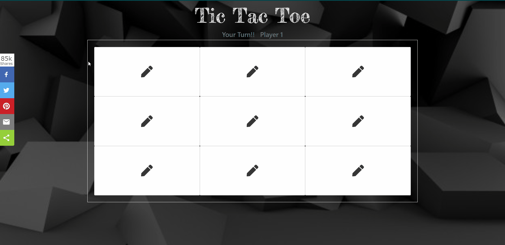

# Tic-Tac-Toe using ReactJS

Hello 🙋‍♂️ ! Welcome to my Tic-Tac-Toe game.
Tic-Tac-Toe is a classic  game (also called Noughts and Crosses) of two players (X & O),who take turns marking the spaces in a 3×3 grid.
The player who succeeds in placing three of their marks in a diagonal, horizontal, or vertical row is the winner.




## To Run
 1) Do git clone of the repository https://github.com/mayur-keswani/Tic-Tac-Toe-using-ReactJS.git.
 2) In the project directory, run: `npm start`


## Assets 🔨
 - Bootstrap-4 cdn
 - react-icons
 - react-toastify
 - sharethis 

The project is made using React hooks (Functional-based): 
## Topics it covers:
 1) useState  
 2) JSX 
 3) props
 4) Setting className dynamically
 5) Lists and Conditionals in React
 


### Need help?

```Javascript
  if (needHelp === true) {
     var emailId = "mayurkeswani2001@gmail.com";
     // email is the best way to reach out to me.
     sendEmail(emailId);
  }
```

_Glad to see you here! Show some love by starring this repo._
```Javascript
 if (isAwesome) {
    // thanks in advance 
    starThisRepository();
  }
```


